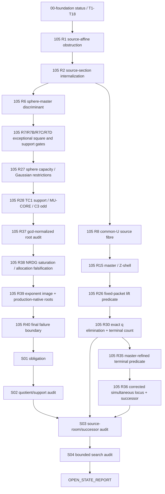

# 105 v3 End-to-End Continuation Report

> Project: `strict-layer-proof-research`  
> Checkout: `ff3c281`  
> Continuation date: 2026-08-21 (Asia/Shanghai)  
> Scope: Strict Layer (A_1)-only  
> Final status: `OPEN`; neither global unliftability nor a full witness was obtained.

## Executive result

The repository was recovered and used as the sole mathematical state source.
The continuation did not manufacture a closure. It established that the R40
production-native quotient is exactly the already frozen R28 \(\mu\)-core, then
located the first valid downstream gate: the full R28 support-complete source
fibre. All current support-complete production roots fail before successor
activation; the only current raw source-room counterexample fails primitive and
\(\Lambda\)-support.

The handoff theorem target is therefore

\[
\boxed{
\text{R28-support-admissible negative quadratic production roots}
\cap\{\mathcal U_0\ne\varnothing\}.
}
\]

The exact failure state is recorded in
[`105_V3_OPEN_STATE_REPORT.md`](105_V3_OPEN_STATE_REPORT.md).

## 1. State reconstruction

The complete recovery is in
[`STATE_RECONSTRUCTION_REPORT.md`](STATE_RECONSTRUCTION_REPORT.md). The
recovered state is:

```yaml
Research State:
  Parent problem: "Three decimal rational squares versus the square of the concatenated rational."
  Active branch: "Strict Layer A1-only."
  DD: EMPTY / CLOSED
  Strict A1: OPEN
  Full witness: NOT FOUND
  Global unliftability: NOT PROVED
  Current bottleneck: "source-completed primitive/support/root incidence"
  Global digit-cell bound: NOT PROVED
  External literature dependency: NONE ACTIVE
```

### Frozen state used

The continuation retained the following objects together, without projection:

\[
P_1^2+P_2^2+P_3^2=Q_0^2,
\qquad
\gcd(P_1,P_2,P_3,Q_0)=1,
\]

\[
M_0=u_0AW=g_0a,
\qquad
P_1=g_0\mu s,
\qquad
\gcd(a,\mu s)=1,
\]

\[
P_2=u_0WC_2,
\qquad
P_3=u_0AC_3,
\]

the exact exponent image

\[
m_2=\operatorname{dig}(A\Lambda q),
\qquad
m_3=\operatorname{dig}(W\Lambda q),
\qquad
g=m_3-n_3,
\qquad
k=n_2-m_2-g\ge1,
\]

the R30/R35 terminal predicate

\[
\exists U\in\mathcal U_0,
\quad
\exists q\in[Q_-,Q_*],
\quad
\gcd(q,FU)=1,
\qquad
Q_*=\min(Q_+,Q_{\rm master}),
\]

and the R36 successor condition

\[
U_{\min}<R_{\rm src}
\]

with \(U_{\min}\) computed from the integer edge and the completed periodic
source residues.

## 2. Artifact dependency graph



Dependency discipline:

- R26 is retained only as a fixed-packet finite lift wrapper; its early
  global-sounding language is superseded by R27--R40.
- R28's TC1 support theorem is the provenance source for R40-DIV.
- R30 q-elimination is used only after retaining both source and denominator
  meanings.
- R36 successor formulas are conditional on a completed source profile.
- R39 production roots are ambient production roots until source and support
  gates pass.

## 3. Literature usage record

The full record is in
[`105_V3_LITERATURE_USAGE.md`](105_V3_LITERATURE_USAGE.md).

```yaml
LiteratureNeed:
  Decision: NOT_TRIGGERED
  Reason: "The active uncertainty is a project-specific source-affine intersection, not a missing generic theorem."
  Required evidence: "Internal exact derivations, repository certificates, and bounded integer replay."
SourceArtifact:
  Source: none
  Claim/Theorem: none imported as a premise
  Authority: not applicable
  Applicability: not applicable
  How integrated: not integrated
Historical source audit:
  Location: archive-by-series/65-bridge-and-provenance/source_audit.md
  Use: provenance boundary only; not an active 105 theorem dependency
```

This avoids importing a generic theorem that controls an ambient projection but
does not preserve the actual decimal source section.

## 4. Mathematical continuation

### Stage 01 — obligation recovery

Artifact: [`105_V3_STAGE_01_R40_OBLIGATION.md`](105_V3_STAGE_01_R40_OBLIGATION.md)

```yaml
Stage ID: 105-V3-S01
Objective: "Continue from the frozen R40 boundary."
Research Obligation:
  Question: "Is the source-native negative quadratic production-root locus disjoint from U_0 after primitive, support, successor, MASTER, and reconstruction gates?"
  Current evidence: "R39 source-empty primitive root; R40 source-room nonprimitive/support-failing packet; no global digit bound."
  Expected resolution: "Global contradiction/bound or first full source-completed terminal point."
Status: OPEN
```

### Stage 02 — quotient and support audit

Artifact: [`105_V3_STAGE_02_R40_QUOTIENT_AND_SUPPORT_AUDIT.md`](105_V3_STAGE_02_R40_QUOTIENT_AND_SUPPORT_AUDIT.md)

R28 already proves

\[
u_0\mid W+A10^{n+g},
\qquad
(u_0,A)=1,
\qquad
\gcd(u_0,W)=\gcd(u_0,10^{n+g}),
\]

plus

\[
A\mid g_1^*Q_0,
\qquad
W^{(10')}\mid g_1^*Q_0,
\qquad
C_3\text{ odd},
\qquad
(\mu,C_2C_3)=1.
\]

R40-DIV is the same divisibility in the production-native notation
(m_3=n+g). With

\[
H=W+A10^{m_3},quad
X=10^{m_2+m_3},quad
Y=10^{n_3},quad
T=C_3+YC_2,quad
a_0=AW/g_0,quad
\ell=H/u_0,
\]

the production equation reduces exactly to

\[
(\mu\ell+a_0X)Q_0=\mu AW(X10^k s+T),
\]

equivalently

\[
\boxed{
\mu\bigl(Q_0\ell-AW(C_3+YC_2)\bigr)
=a_0X(10^kP_1-Q_0).
}
\]

This is R28's \(\mu\)-core. The continuation result is therefore

```text
R40_DIV_INFORMATION_GAIN_OVER_R28 = 0
R40_QUOTIENT_NORMAL_FORM = R28_MU_CORE
```

This is a recovered equivalence, not a new independent theorem.

### Stage 03 — source room and successor audit

Artifacts:

- [`105_V3_STAGE_03_SOURCE_ROOM_SUCCESSOR_OBLIGATION.md`](105_V3_STAGE_03_SOURCE_ROOM_SUCCESSOR_OBLIGATION.md)
- [`105_V3_STAGE_03_SOURCE_ROOM_SUCCESSOR_AUDIT.md`](105_V3_STAGE_03_SOURCE_ROOM_SUCCESSOR_AUDIT.md)

For \(d=n_2-n_3\), the real source intervals overlap exactly when

\[
\boxed{10^{d-1}<C_2/C_3<10^{d+1}.}
\tag{REAL-ROOM}
\]

The exact integer gate remains

\[
U_{\rm lo}
=
\max\left(
\left\lceil10^{n_2-1}/C_2\right\rceil,
\left\lceil10^{n_3-1}/C_3\right\rceil
\right),
\]

\[
U_{\rm hi}
=
\min\left(
\left\lfloor(10^{n_2}-1)/C_2\right\rfloor,
\left\lfloor(10^{n_3}-1)/C_3\right\rfloor
\right).
\]

Raw source existence is \(U_{\rm lo}\le U_{\rm hi}\), while completed source
existence is the stronger \(U_{\min}<R_{\rm src}\) after periodic selectors
and primitive coprimality.

No current support-complete root reaches the successor gate. Applying successor
or MASTER to such a root would be an invalid downstream inference.

### Stage 04 — exact bounded falsification

Artifact: [105_V3_STAGE_04_BOUNDED_SEARCH_AUDIT.md](105_V3_STAGE_04_BOUNDED_SEARCH_AUDIT.md)

The rerunnable scripts are:

- [`105_V3_R40_quotient_audit.py`](105_V3_R40_quotient_audit.py)
- [`105_V3_R40_small_root_search.py`](105_V3_R40_small_root_search.py)

The bounded search used \(Q_0\le300\), \(1\le n_3\le3\), and
\(1\le q\le4\), with integer production incidence solved for \(K=10^k\).
The exact invocation was
python -B -c "import runpy; m=runpy.run_path('105_V3_R40_small_root_search.py'); m['run'](300,3,4)".
It retained primitive sphere, selector, exponent synchronization, R28 shape,
and R28 support gates.

```text
PACKETS=18270
SELECTOR_STATES=3521885
PRODUCTION_ROOTS=7
R40_DIV_FAILURES=0
R28_SHAPE_ROOTS=3
R28_SUPPORT_ROOTS=1
ROOTS_WITH_U0_GT_1=4
SOURCE_ROOM_ROOTS=0
SOURCE_ROOM_ROOTS_U0_GT_1=0
```

The one R28-support root in this bounded scope is

\[
(P_1,P_2,P_3,Q_0)=(24,52,159,169),
\]

with \(U_{\rm lo}=1>0=U_{\rm hi}\). This is computational evidence only.

## 5. New lemmas and results ledger

| Item | Status | Evidence | Interpretation |
|---|---|---|---|
| R40 quotient normalization | `PROVED AS EQUIVALENCE` | symbolic substitution | exactly R28 \(\mu\)-core; no new information |
| R40-DIV | `PROVED / RECOVERED` | R28 theorem and R40 rederivation | fixed-cell divisibility only |
| REAL-ROOM | `PROVED` | direct interval comparison | local source criterion, not global obstruction |
| R39 packet audit | `PROVED/REPLAYED` | `r39_verify.py` and quotient audit | primitive/support pass, source room fails |
| R40 packet audit | `PROVED/REPLAYED` | quotient audit and R40 report | source room passes, primitive/support fail |
| bounded production-root search | `COMPUTATIONAL` | exact Python integers | 7 roots, 1 R28-support root, 0 raw source-room roots in scope |
| successor nonactivation in current corpus | `COMPUTATIONAL` | first-failure ordering | no legal source-completed root reaches successor |
| global Strict-A1 unliftability | `OPEN` | no all-cell theorem | not claimed |
| full Strict-A1 witness | `OPEN` | no terminal pair | reconstruction not triggered |

## 6. Remaining obstruction

```yaml
OPEN_STATE_REPORT
Current strongest reduction: "R28-support-admissible negative quadratic production roots intersected with completed source fibre U_0, successor, MASTER, and terminal q predicate."
Minimal obstruction: "Support-complete roots fail source room; source-room counterexample fails primitivity and Lambda-support."
Why existing methods fail: "Ambient square/Smith/Gaussian/valuation routes saturate at R28 MU-CORE; finite cells do not imply a global bound; successor is downstream of source completion."
Missing invariant: "A uniform source-native coupling between MU-CORE/support and strict integer digit-room occupancy, or a global digit-complexity bound."
Most promising next attack: "Prove source/support incompatibility or find the first support-complete source point, then activate successor → MASTER → terminal q count → reverse reconstruction."
```

No closure is manufactured from the bounded result.

## 7. v3 workflow evaluation

### Research State First

Pass. The state was recovered from the repository and persisted in
`STATE_RECONSTRUCTION_REPORT.md` before continuation. The R26 overclaim was
explicitly narrowed using R27--R40.

### Research Obligation Tracking

Pass. Each new direction has a YAML obligation in S01 and S03, with question,
reason, evidence, expected resolution, method, and status. The R40-DIV route was
retired after its information gain was audited as zero over R28.

### Evidence discipline

Pass. The report distinguishes:

- `PROVED`: exact identities, scoped source/support theorems, and REAL-ROOM;
- `COMPUTATIONAL`: bounded packet counts and finite no-hit searches;
- `HEURISTIC/OPEN`: possible global source/support incompatibility;
- `DISPROVED/RETIRED`: weak synchronization-to-lift and stronger factor-allocation
  conjectures.

No relaxed solution, projection, finite computation, or necessary condition was
silently upgraded to a Strict-A1 conclusion.

### Literature pipeline

Pass with `NOT_TRIGGERED`: the live proof state is self-contained and no generic
external theorem was imported. The historical `source_audit.md` remains a
provenance boundary only.

### Artifact auditability

Pass. Every new stage has a persistent markdown artifact; computation has
rerunnable scripts; exact packet values and first failures are recorded; the
open-state report names the missing invariant and next attack.
The byte-level manifest is
[105_V3_SHA256_MANIFEST.txt](105_V3_SHA256_MANIFEST.txt).

## 8. Final self-audit

```yaml
SelfAudit:
  Used repository assets: PASS
  Recovery report created before continuation: PASS
  Frozen assumptions recorded: PASS
  Closed/open/computational/heuristic boundary: PASS
  Research obligations recorded before new directions: PASS
  Stage logs persisted: PASS
  External claims sourced: "PASS — no external theorem used; NOT_TRIGGERED recorded"
  Hidden projection-to-lift jump: "NOT FOUND"
  Hidden finite-search-to-universal jump: "NOT FOUND"
  Successor applied before source completion: NO
  Root reconstruction without terminal pair: NO
  Global closure claimed: NO
  Next researcher can continue from artifacts: PASS
```

One archived verifier, `r36_sourcefirst_unit_shell.py`, is not portable in this
checkout because it hard-codes `/mnt/data/105-R36`; that execution failure is an
environment/path issue, not mathematical evidence. The portable R39, R11 and
R13 exact verifiers passed, and the new continuation scripts ran with the
workspace Python runtime.

## 9. Handoff

Start the next session at
[`105_V3_STAGE_03_SOURCE_ROOM_SUCCESSOR_OBLIGATION.md`](105_V3_STAGE_03_SOURCE_ROOM_SUCCESSOR_OBLIGATION.md),
then consult the R28 \(\mu\)-core and support package. Do not reopen R40-DIV as
an independent route. The only justified next outcomes are:

1. a global source/support theorem with all digit cells covered; or
2. the first full source-completed point, followed in order by successor,
   MASTER-refined q counting, and original decimal root reconstruction; or
3. a sharper `OPEN_STATE_REPORT` identifying the next missing invariant.
